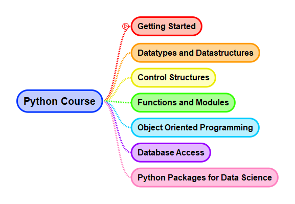
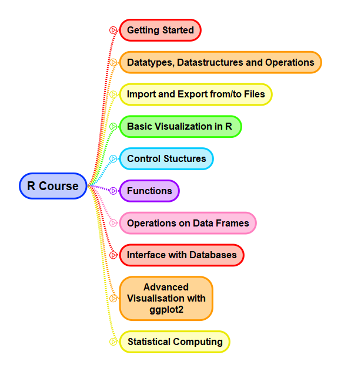

# Lecture Programming for Data Science

* Author: Prof. Dr. Johannes Maucher
* Email: maucher@hdm-stuttgart.de
* Last Update: 27.09.2017

## Part Python

> This Python course is the first part of the lecture [Programming Languages for Data Scientists](https://www.hdm-stuttgart.de/ds/de/weiterbildung/modul_07/) within the master program [Data Science and Business Analytics](https://www.hdm-stuttgart.de/ds/de/masterstudium) at HdM Stuttgart. In the second part of this lecture the programming language *R* is introduced. Both programming languages are introduced in a quite general manner. However, in the selection of routines, packages and examples Data Science tasks are focused. The concrete implementation of typical Data-Science-/Data-Mining-processes is not subject of this course but of the follow-up lecture [Data Mining Process](https://www.hdm-stuttgart.de/ds/de/weiterbildung/modul_12).  

### Getting started with Python
In [Getting started with Python](Python/Lecture/01GettingStarted.ipynb) you will learn about the main features of Python, in particular the ones, which make it a number-one tool for all kinds of data science tasks. Moreover, the most important Python distributions and packages for data scientists and some popular Integrated Development Environments (IDEs) are sketched.

Basic routines in the daily work with Python are summarized in notebook [Basic Routines](Python/Lecture/02BasicRoutines.ipynb). You will learn how to download and install packages, how to get help and how to import/export data into/from Python scripts.

### Datatypes and Datastructures
Notebook [Numeric Datatypes](Python/Lecture/02DataTypesNumeric.ipynb) provides a short introduction into numeric datatypes and how Python can be applied for standard arithmetic calculations. More complex datatypes such as strings, lists, dictionaries etc. and the operations and functions available for these types are described in the notebooks [Sequential Datatypes](Python/Lecture/03aDataTypesSequential.ipynb), [Dictionaries](Python/Lecture/03bDataTypesDictionaries.ipynb) and [Sets](Python/Lecture/03cDataTypesSets.ipynb). 

### Controll Structures
Computer programs usually consist of a list of commands. The order in which these commands are processed can be controlled by different control-flow constructs such as *if-then-else*, *for-loops*, *while-loops*, etc. Such control flow elements are defined in all programming languages. Syntax and usage of these elements in Python is described in notebook [Control Structures](Python/Lecture/04ControllStructures.ipynb).  

### Functions and Modules
Simple computer programs are usually implemented in single scripts (files). Such scripts typically consist of a list of commands, that must be executed to solve the given task. For more complex tasks implementation in single scripts can be inefficient and error-prone. In order to provide readability, maintainability, reusability and reliability, complex software is usually structured in modules and functions. Notebook [Modules and Functions](Python/Lecture/05Functions.ipynb) first introduces the notions of *packages*, *modules* and *functions* in Python. Then the definition and application of functions in Python is described.   

### Object Oriented Programming in Python
Splitting code in smaller reusable and manageable functions, as introduced in the previous section, is one way to realize modularity. Another, more elaborated and more comprehensive approach is object oriented programing (OOP). An object oriented software design consists of objects that interact with one another. Notebook [Object Oriented Programming](Python/Lecture/06ObjectOrientedProgramming.ipynb) demonstrates the key OOP concepts in Python, the definition of classes and the instantiation of objects. Classes can be considered as blueprints and objects are concrete instances of these blueprints. 

### Data Base Access
Software, in particular software for Data Science applications, often must interfaces with databases. For all of the main database-types (SQL, MongoDB, ...) there exists Python packages to adapt the database to the Python programm. In this lecture access to *PostgreSQL* databases is introduced and demonstrated in notebook [Database Access](Python/Lecture/07DataBasePandas.ipynb).     

### Python Libraries for Data Science
The main Python modules, which are usually applied for data analysis are:

* [Basics in Numpy](Python/Lecture/NP01numpyBasics.ipynb)
* [Basics in Matplotlib](Python/Lecture/PLT01visualization.ipynb)
* [Basics in Pandas](Python/Lecture/PD01Pandas.ipynb)

Moreover, [Scikit-Learn](http://scikit-learn.org/stable/index.html) is the most comprehensive library for Machine Learning. It is primarily built on Numpy. In particular internal and external data structures are [Numpy Arrays](https://docs.scipy.org/doc/numpy/reference/generated/numpy.array.html). *Scikit-Learn* will not be applied in the course [Programming for Data Science](https://www.hdm-stuttgart.de/ds/de/weiterbildung/modul_07/), but it is the main framework for the follow-up module [Data Mining Process](https://www.hdm-stuttgart.de/ds/de/weiterbildung/modul_12).

## Part R

### Basics

   1. [Getting Started with R](R/Lecture/01Basics/00GettingStartedR.ipynb)
   2. [Datatypes](R/Lecture/01Basics/02DataTypes.ipynb)
   3. [Import and Export](R/Lecture/01Basics/03ImportExport.ipynb)
   4. [Visualization](R/Lecture/01Basics/04Visualisation.ipynb)
   5. [Control Structures](R/Lecture/01Basics/05ControlStructures.ipynb)
   6. [Functions](R/Lecture/01Basics/06Functions.ipynb)
   
### Data Management

   1. [Operations on Data Frames](R/Lecture/02DataManagement/01OperationsOnDataframes.ipynb)
   1. [Database Access](R/Lecture/02DataManagement/02DataBaseAccess.ipynb)
   1. [Database Aceess Advanced](R/Lecture/02DataManagement/03DataBaseAcessAdvanced1.ipynb)
   
### Visualization

   1. [Visualization with ggplot2](R/Lecture/04Visualization/01ggplot2.ipynb)
   
   
### Statistical Computing
   1. [Selected Functions for Statistical Computing](R/Lecture/05StatisticalComputing/01BasicFunctions.ipynb)
   1. [Univariate Analysis](R/Lecture/05StatisticalComputing/01UnivariateAnalysis.ipynb)
   2. [Independence and Correlations](R/Lecture/05StatisticalComputing/02IndependenceAndCorrelations.ipynb)
   3. [Regression Analysis](R/Lecture/05StatisticalComputing/03RegressionAnalysis.ipynb)
   4. [Analysis of Variance](R/Lecture/05StatisticalComputing/04ANOVA.ipynb) (not yet included)

